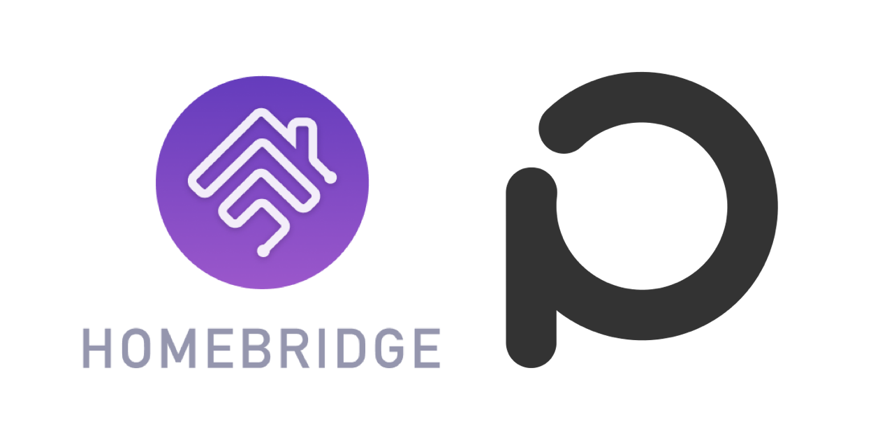

    

# Homebridge deCONZ

## Homebridge plugin for deCONZ
Copyright © 2022 Erik Baauw. All rights reserved.

### Work in Progress
See [Future Development of Homebridge Hue](https://github.com/ebaauw/homebridge-hue/issues/1070) for positioning Homebridge deCONZ versus Homebridge Hue.

The current pre-release of Homebridge deCONZ is not yet functional.
I'm using it to stress-test the technical framework.
See [Releases](https://github.com/ebaauw/homebridge-deconz/releases) for more details.

If you have a question, please post a message to the **#hue** channel of the Homebridge community on [Discord](https://discord.gg/hZubhrz).

### Introduction
This [Homebridge](https://github.com/homebridge/homebridge) plugin exposes to Apple's [HomeKit](http://www.apple.com/ios/home/) ZigBee devices (lights, plugs, sensors, switches, ...) and virtual devices on a deCONZ gateway by dresden elektronik.
Homebridge deCONZ communicates with deCONZ over its [REST API](https://dresden-elektronik.github.io/deconz-rest-doc/), provided by its [REST API plugin](https://github.com/dresden-elektronik/deconz-rest-plugin).
It runs independently from the Phoscon web app, see [deCONZ for Dummies](https://github.com/dresden-elektronik/deconz-rest-plugin/wiki/deCONZ-for-Dummies).

### Prerequisites
You need a deCONZ gateway to connect Homebridge deCONZ to your ZigBee devices (lights, plugs, sensors, switches, ...).
For Zigbee communication, the deCONZ gateway requires a [ConBee II](https://phoscon.de/en/conbee2) or [Conbee](https://phoscon.de/en/conbee) USB stick, or a [RaspBee II](https://phoscon.de/en/raspbee2) or [RaspBee](https://phoscon.de/en/raspbee) Raspberry Pi shield.  
I recommend to run deCONZ with its GUI enabled, even on a headless system.
When needed, you can access the deCONZ GUI over screen sharing.

You need a server to run Homebridge.
This can be anything running [Node.js](https://nodejs.org): from a Raspberry Pi, a NAS system, or an always-on PC running Linux, macOS, or Windows.  
I strongly recommend to use a standard Homebridge installation, see the [Homebridge Wiki](https://github.com/homebridge/homebridge/wiki) for details.
I recommend to run deCONZ and Homebridge deCONZ on the same server, avoiding any network latency between deCONZ and Homebridge deCONZ, and preventing any potential network issues.
I strongly recommend to run Homebridge deCONZ in a separate Homebridge installation, with the Homebridge UI as only other plugin, or in a separate [child bridge](https://github.com/homebridge/homebridge/wiki/Child-Bridges), in a Homebridge installation with other plugins.

To interact with HomeKit, you need an Apple device with Siri or a HomeKit app.  
Please note that Siri and Apple's [Home](https://support.apple.com/en-us/HT204893) app only provide limited HomeKit support.
To configure Homebridge deCONZ, and to use its full features, you need another HomeKit app, like [Eve](https://www.evehome.com/en/eve-app) (free) or Matthias Hochgatterer's [Home+](https://hochgatterer.me/home/) (paid).  
As HomeKit uses mDNS (formally known as Bonjour) to discover Homebridge, the server running Homebridge must be on the same subnet as your Apple devices running HomeKit.
Most cases of _Not Responding_ accessories are due to mDNS issues.  
For remote access and for HomeKit automations (incl. support for wireless switches), you need to setup an Apple TV (4th generation or later), HomePod, or iPad as [home hub](https://support.apple.com/en-us/HT207057).  
I recommend to use the latest released version of the Apple device OS: iOS, iPadOS, macOS, ...
HomeKit doesn't seem to like using different Apple device OS versions.

### Configuration
Most settings for Homebridge deCONZ can be changed at run-time from HomeKit, by the owner of the HomeKit home.
These settings are persisted across Homebridge restarts.
In config.json, you only need to specify the platform, and maybe the hostname or IP address and port of your deCONZ gateway(s).
See the [Wiki](https://github.com/ebaauw/homebridge-deconz/wiki/Configuration) for details and examples.

Homebridge deCONZ exposes a [gateway accessory](https://github.com/ebaauw/homebridge-deconz/wiki/Gateway-Accessory) for each deCONZ gateway.
In Apple's Home app, this accessory looks like a wireless switch; you'll need another HomeKit app to configure the accessory.

When when it connects to a deCONZ gateway for the first time, Homebridge deCONZ will try to obtain an API key for two minutes, before exposing the gateway accessory.
Unless Homebridge deCONZ runs on the same server as the deCONZ gateway, you need to unlock the gateway to allow Homebridge deCONZ to obtain an API key.
After two minutes, Homebridge deCONZ will give up, exposing the gateway accessory anyways, but marking it inactive.
Set _Enabled_ on the _Gateway Settings_ service of the gateway accessory to retry obtaining an API key.
Homebridge deCONZ will **not** retry to obtain an API key on Homebridge restart.

After setting _Enabled_ on the _Device Settings_ service for Groups Settings, Lights Settings, or Sensors Settings, Homebridge Deconz will expose an accessory for each of the corresponding devices.
When clearing _Enabled_, the corresponding device accessories are removed from HomeKit.  
Each device accessory has a _Device Settings_ service, to configure the device.
Clear _Enabled_ on that service, to blacklist the device, and remove the associated accessory from HomeKit.  
The gateway accessory gains an additional _Device Settings_ service for each blacklisted device.
To re-expose the corresponding accessory, set _Enabled_ on that service.  
Note that, unlike Homebridge Hue, Homebridge deCONZ handles blacklisting per device, instead of per resource.
Exposing _Lights_ will include the ZHAConsumption and ZHAPower `/sensors` resources for smart plugs, and the ZHABattery for window covering devices; exposing _Sensors_ will exclude these.  
Note that HomeKit doesn't like configuration changes.
Allow ample time after exposing or removing accessories for HomeKit to sync the changed configuration to all Apple devices.

Note that currently, each device accessory only carries a dummy _Stateless Programmable Switch_ service (to make it visible in Home).
